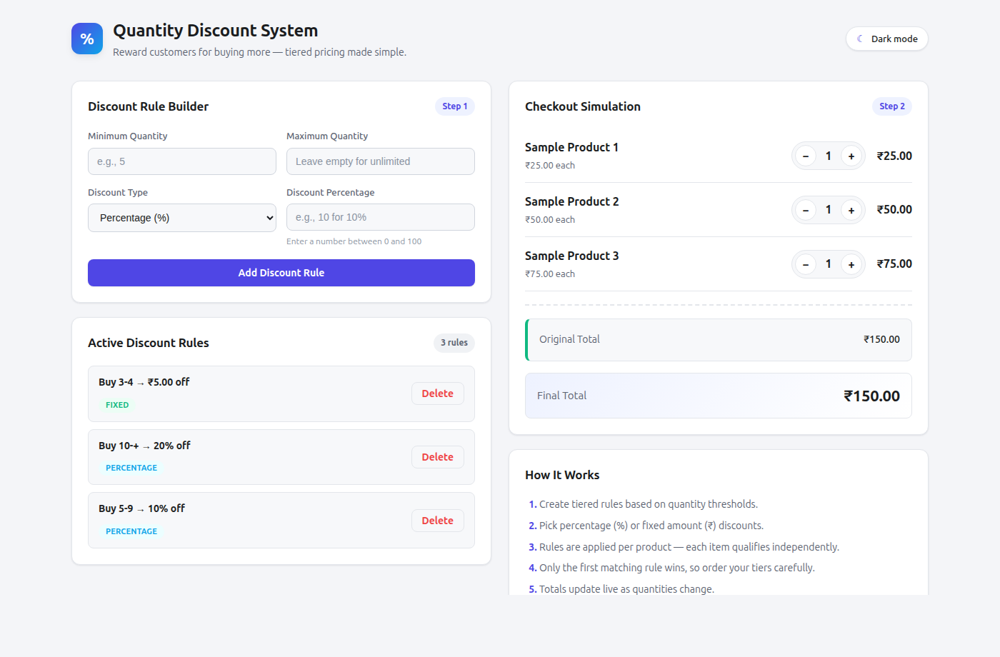
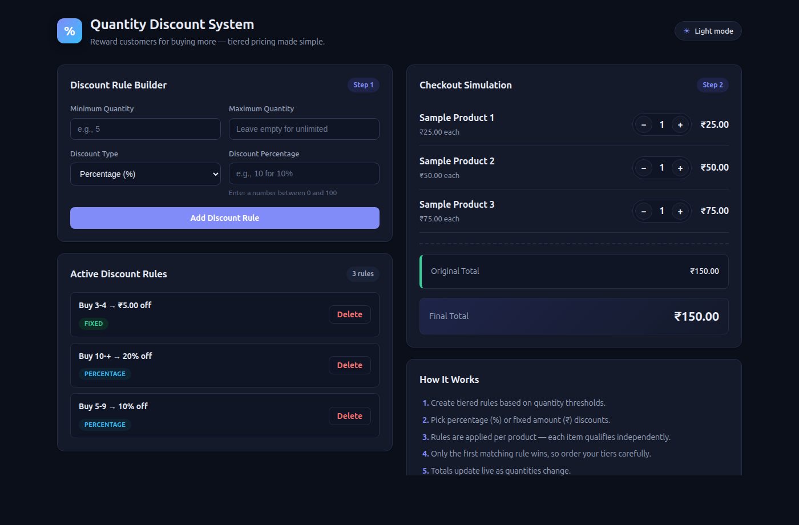

# Quantity Discount System

A full-stack web application that lets merchants create **quantity-based discount rules** and preview them live in a simulated checkout. Built with **React + Vite** on the frontend, **Express** on the backend, and **MySQL** for persistence, with Shopify Polaris and App Bridge integrations ready for embedding inside a Shopify admin.

> Reward customers for buying more — define a rule once, see the savings apply instantly across every product in the cart.

---

## Preview

**Light theme**



**Dark theme**



One-click theme toggle in the header, preference stored in `localStorage`.

---

## Table of Contents

- [Preview](#preview)
- [Overview](#overview)
- [Features](#features)
- [Architecture](#architecture)
- [Tech Stack](#tech-stack)
- [Project Structure](#project-structure)
- [Prerequisites](#prerequisites)
- [Getting Started](#getting-started)
- [Environment Variables](#environment-variables)
- [Database Setup](#database-setup)
- [Running the App](#running-the-app)
- [Usage Guide](#usage-guide)
- [Theming](#theming)
- [API Reference](#api-reference)
- [How Discounts Are Calculated](#how-discounts-are-calculated)
- [Example Savings](#example-savings)
- [Use Cases](#use-cases)
- [Key Benefits](#key-benefits)
- [Troubleshooting](#troubleshooting)
- [Roadmap](#roadmap)
- [License](#license)

---

## Overview

The **Quantity Discount System** helps store owners convert higher cart quantities into better prices. Instead of wiring up complex promotion engines, merchants can define simple tiered rules such as:

- Buy **2–4** → get **10% off**
- Buy **5–9** → get **15% off**
- Buy **10+** → get **₹50 flat off**

Each rule is persisted to MySQL through a REST API and applied per-item in a live cart preview, so merchants can validate pricing before publishing.

---

## Features

| Feature | Description |
| --- | --- |
| **Rule Builder** | Create tiered rules with a minimum quantity, optional maximum, and discount value. |
| **Two Discount Types** | Choose between **percentage** (%) or **fixed amount** (₹) discounts. |
| **Input Validation** | Rejects invalid ranges (min > max), negatives, and percentages above 100. |
| **Live Checkout Simulation** | Adjust cart quantities and watch totals update in real time. |
| **Per-Product Application** | Rules are evaluated individually for each line item in the cart. |
| **Savings Bar** | Visual progress bar shows the effective discount percentage on the cart. |
| **Persistent Storage** | Rules are saved in MySQL and survive page reloads. |
| **Active Rule List** | Review every rule at a glance and remove any that are no longer needed. |
| **Transparent Breakdown** | See original total, per-item discount messages, and final payable amount. |
| **Light & Dark Theme** | One-click theme toggle; preference is persisted in `localStorage`. |
| **Error Banners** | Clear, non-blocking alerts when the API is unreachable or validation fails. |
| **Shopify-Ready** | Polaris, App Bridge, and Discount App Components are pre-installed for embedded-app use. |

---

## Architecture

```
 ┌─────────────────────┐    REST / JSON     ┌─────────────────────┐     mysql2      ┌──────────────────────┐
 │  Browser            │ ─────────────────► │  Express API        │ ──────────────► │  MySQL               │
 │  React + Vite       │ ◄───────────────── │  localhost:3000     │ ◄────────────── │  shopify-app-history │
 └─────────────────────┘                    └─────────────────────┘                 └──────────────────────┘
          │
          └ ─ ─ ─ future ─ ─► Shopify Admin (App Bridge)
```

| Layer     | Responsibility                                                          |
| --------- | ----------------------------------------------------------------------- |
| Browser   | React UI, live cart simulation, rule builder, theme toggle              |
| Express   | Thin REST layer — validates shape, executes SQL, returns JSON           |
| MySQL     | Single `product_discount` table, no ORM, plain parameterized queries    |
| App Bridge| (Optional) embed inside Shopify admin using the already-installed deps  |

Credentials and ports are loaded from a `.env` file via `dotenv`.

---

## Tech Stack

**Frontend**
- React 18
- Vite 7
- Shopify Polaris, App Bridge React, Discount App Components

**Backend**
- Node.js + Express 5
- MySQL 2 (`mysql2` driver)
- CORS, dotenv

**Tooling**
- ESLint (flat config)
- Nodemon + Concurrently for dev workflows

---

## Project Structure

```
my-app/
├── public/                 # Static assets served by Vite
├── server/
│   └── index.js            # Express API + MySQL connection (reads .env)
├── src/
│   ├── App.jsx             # Main UI: rule builder + checkout simulator + theme toggle
│   ├── App.css             # Theme variables + component styles (light/dark)
│   ├── main.jsx            # React entry point
│   └── index.css           # Minimal global reset
├── index.html              # Vite HTML shell
├── vite.config.js          # Vite configuration
├── eslint.config.js        # Lint rules
├── .env.example            # Template for local environment variables
└── package.json
```

---

## Prerequisites

Before starting, make sure you have:

- **Node.js** ≥ 18 (LTS recommended)
- **npm** ≥ 9 (or pnpm / yarn)
- **MySQL** ≥ 8.0 running locally
- A MySQL user with privileges to create databases and tables

---

## Getting Started

### 1. Clone the repository

```bash
git clone https://github.com/<your-username>/<your-repo>.git
cd <your-repo>/my-app
```

### 2. Install dependencies

```bash
npm install
```

### 3. Configure environment

Copy the example env file and fill in your local credentials:

```bash
cp .env.example .env
```

Then edit `.env`:

```env
DB_HOST=localhost
DB_USER=your_mysql_user
DB_PASSWORD=your_mysql_password
DB_NAME=shopify-app-history
PORT=3000
```

The `.env` file is gitignored — your credentials will not be committed.

---

## Environment Variables

### Server (`.env`)

| Variable | Default | Description |
| --- | --- | --- |
| `DB_HOST` | `localhost` | MySQL host |
| `DB_USER` | `root` | MySQL user |
| `DB_PASSWORD` | *(empty)* | MySQL password |
| `DB_NAME` | `shopify-app-history` | Database name |
| `PORT` | `3000` | Express listen port |

### Frontend (optional)

| Variable | Default | Description |
| --- | --- | --- |
| `VITE_API_BASE` | `http://localhost:3000` | Base URL the React app uses to reach the API |

Set `VITE_API_BASE` in a `.env` / `.env.local` file if your backend runs on a different host or port.

---

## Database Setup

Create the database and the `product_discount` table:

```sql
CREATE DATABASE IF NOT EXISTS `shopify-app-history`;
USE `shopify-app-history`;

CREATE TABLE IF NOT EXISTS product_discount (
  id            INT AUTO_INCREMENT PRIMARY KEY,
  rule_id       VARCHAR(100) NOT NULL UNIQUE,
  minQuntity    INT          NOT NULL,
  maxQuntity    INT          NULL,
  discountType  ENUM('percentage','fixed') NOT NULL,
  discountvalue DECIMAL(10,2) NOT NULL,
  created_at    TIMESTAMP DEFAULT CURRENT_TIMESTAMP
);
```

> **Why `maxQuntity` is nullable:** when a rule has no upper bound, the frontend sends `null` and the client normalizer treats `null` as `Infinity`. This round-trip keeps "unlimited" rules working correctly after reload.

---

## Running the App

Open two terminals from the `my-app` directory.

**Terminal 1 — Backend API**
```bash
node server/index.js
# → Connected successfully with : shopify-app-history
# → Server running on http://localhost:3000
```

**Terminal 2 — Frontend (Vite dev server)**
```bash
npm run dev
# → Local: http://localhost:5173
```

Available scripts:

| Script | Purpose |
| --- | --- |
| `npm run dev` | Start the Vite dev server with HMR |
| `npm run build` | Produce an optimized production build |
| `npm run preview` | Preview the production build locally |
| `npm run lint` | Run ESLint across the codebase |

---

## Usage Guide

### Step 1 — Create a discount rule
1. Enter a **Minimum Quantity** (e.g. `5`).
2. Optionally set a **Maximum Quantity** (leave blank for unlimited).
3. Pick a **Discount Type** — *Percentage* or *Fixed Amount*.
4. Enter the discount value (e.g. `10` for 10% or `5.00` for ₹5 off).
5. Click **Add Discount Rule**. The rule is saved to MySQL and appears in the *Active Discount Rules* list.

Invalid input (negative values, min > max, percentage above 100) is blocked with an inline error.

### Step 2 — Simulate a checkout
1. Use the **+ / −** buttons next to each sample product to change quantities.
2. Watch the **Original Total**, **Discounts Applied**, and **Final Total** update live.
3. The **Savings Bar** visualizes the overall discount percentage on the cart.

### Step 3 — Manage rules
Remove rules you no longer need with the **Delete** button. Deletions call the API and remove the row from MySQL immediately.

---

## Theming

The app ships with a first-class **light** and **dark** theme.

- Click the pill-shaped toggle in the header to switch themes.
- Preference is saved to `localStorage` (`qds-theme`) and restored on next visit.
- If no preference is saved, the app respects your OS setting via `prefers-color-scheme`.
- All surfaces are driven by CSS custom properties on `[data-theme="light" | "dark"]`, so the switch is instant and consistent.

---

## API Reference

Base URL: `http://localhost:3000` (configurable via `PORT` / `VITE_API_BASE`)

### `POST /api/discount-rules`
Create a new rule. Send `maxQuntity: null` for an unlimited upper bound.

**Request body**
```json
{
  "rule_id": "rule_1717000000000_0",
  "minQuntity": 5,
  "maxQuntity": 10,
  "discountType": "percentage",
  "discountvalue": 10
}
```

**Response** — `200 OK`
```json
{ "message": "Discount rule inserted successfully", "insertId": 42 }
```

### `GET /api/discount-rules`
Return all rules ordered by most recent first.

**Response** — `200 OK`
```json
[
  {
    "id": 42,
    "rule_id": "rule_1717000000000_0",
    "minQuntity": 5,
    "maxQuntity": 10,
    "discountType": "percentage",
    "discountvalue": "10.00"
  }
]
```

> Note: MySQL returns `DECIMAL` values as strings. The React client coerces with `Number()` before formatting.

### `DELETE /api/discount-rules/:id`
Delete a rule by its `rule_id`.

**Response** — `200 OK`
```json
{ "message": "Rule deleted successfully" }
```

`404` is returned if no rule matches.

---

## How Discounts Are Calculated

The cart recalculates on every change. For each line item:

```
  ┌──────────────────────┐
  │  Cart updated        │
  └──────────┬───────────┘
             ▼
  ┌──────────────────────┐       No        ┌────────────────────┐
  │  Quantity matches a  │ ─────────────►  │ Keep original price │
  │  rule range?         │                 └─────────┬───────────┘
  └──────────┬───────────┘                           │
             │ Yes                                   │
             ▼                                       │
  ┌──────────────────────┐                           │
  │  Percentage?         │ ── yes ► total × value/100│
  │  Fixed?              │ ── yes ► min(value,total) │
  └──────────┬───────────┘                           │
             ▼                                       │
  ┌──────────────────────┐                           │
  │  Subtract from line  │                           │
  └──────────┬───────────┘                           │
             └────────────────┬──────────────────────┘
                              ▼
                    ┌──────────────────────┐
                    │ Aggregate cart total │
                    └──────────────────────┘
```

**Rules of evaluation**

1. Rules are checked in insertion order; the **first match wins** per item.
2. Percentage discounts are computed off the line subtotal, not the cart total.
3. Fixed discounts are capped at the line subtotal — a single line can never go negative.
4. Items whose quantity doesn't fall inside any range keep their original price.

---

## Example Savings

Sample cart at ₹300 original total, with a **10% off** rule for quantities 5–10:

```
  Original total  ₹300  ████████████████████████████████████████  100%
  You save         ₹30  ████                                       10%
  You pay         ₹270  ████████████████████████████████████       90%
```

A quick look at how percentage tiers scale with quantity (₹25 unit price):

| Quantity | Rule Applied   | Original | Discount | Final  |
| -------: | -------------- | -------: | -------: | -----: |
|        1 | —              |      ₹25 |       ₹0 |    ₹25 |
|        3 | 5% off (3–4)   |      ₹75 |    ₹3.75 | ₹71.25 |
|        6 | 10% off (5–9)  |     ₹150 |      ₹15 |   ₹135 |
|       12 | 20% off (10+)  |     ₹300 |      ₹60 |   ₹240 |

---

## Use Cases

- **E-commerce stores** running *Buy More, Save More* promotions.
- **Wholesale / B2B** pricing tiers based on order volume.
- **Shopify apps** that need a lightweight, embedded discount engine (Polaris + App Bridge already wired in).
- **Learning project** for full-stack React + Express + MySQL patterns.
- **Internal tooling** where merchandising teams need to preview price changes before pushing live.

---

## Key Benefits

- **Zero lock-in** — plain SQL, plain REST, no proprietary abstractions.
- **Live feedback loop** — every quantity change recalculates the cart instantly.
- **Readable data model** — one table, one responsibility.
- **Incremental adoption** — start standalone, graduate to embedded Shopify app when ready.
- **Accessible out of the box** — semantic labels, visible focus rings, and dark mode support.
- **Extensible** — swap the cart simulator for real Shopify cart data without changing the rule schema.

---

## Troubleshooting

**"Could not load saved rules" banner**
The React app can't reach the API. Verify:
- `node server/index.js` is running and logs `Connected successfully with : shopify-app-history`.
- `curl http://localhost:3000/api/discount-rules` returns `[]` or a list of rules.
- `VITE_API_BASE` (if set) points to the right host.

**"Access denied for user ..." on server start**
Your `.env` credentials don't match MySQL. Test them manually:
```bash
mysql -u "$DB_USER" -p"$DB_PASSWORD" -e "SHOW DATABASES;"
```

**Rules with no maximum stop matching after reload**
Ensure `maxQuntity` is declared `NULL`-able in the schema (see [Database Setup](#database-setup)). Older schemas using `NOT NULL` break the `null ↔ Infinity` round-trip.

**Theme doesn't persist**
Your browser may be blocking `localStorage` (e.g. private mode). The toggle still works per-session.

---

## Roadmap

- [ ] Rule validation server-side (currently client-only)
- [ ] Non-overlapping range detection with warnings
- [ ] Authentication for the admin API
- [ ] Bulk import / export of rules as CSV
- [ ] Unit tests for the discount calculator
- [ ] Full Shopify embedded-app deployment guide

---

## License

Released under the MIT License. Feel free to fork, adapt, and ship.
